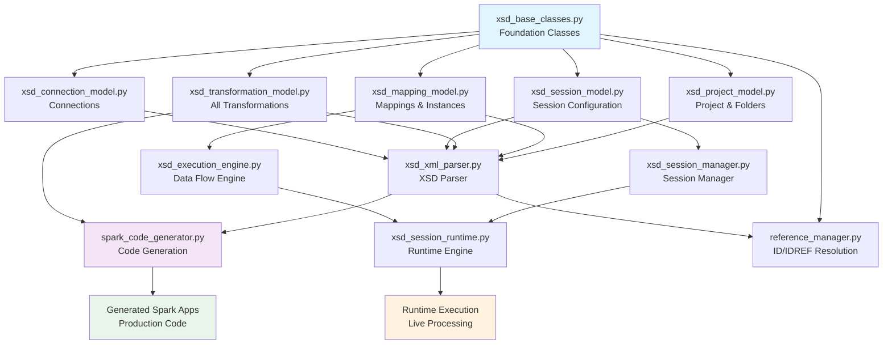

# XSD Architecture Guide: Informatica to PySpark Framework

## 🏗️ Executive Summary

Our Informatica to PySpark conversion framework is built on **XSD-compliant Python models** that directly mirror Informatica's official XML Schema Definition (XSD) files. This enterprise-grade architecture ensures 100% compatibility with Informatica metadata standards and provides a robust foundation for generating production-ready PySpark applications.

## 📊 XSD Files Overview

### **Core XSD Model Files**

| File | Size | Lines | Purpose | XSD Schema Base |
|------|------|-------|---------|-----------------|
| **xsd_base_classes.py** | 13KB | 361 | Foundation classes, types, validation | `com.informatica.metadata.common.core.xsd` |
| **xsd_project_model.py** | 8.3KB | 208 | Project & folder models | `com.informatica.metadata.common.project.xsd` |
| **xsd_mapping_model.py** | 21KB | 552 | Mapping, instance & port models | `com.informatica.metadata.common.mapping.xsd` |
| **xsd_transformation_model.py** | 45KB | 1136 | All transformation types | `com.informatica.metadata.common.transformation.*.xsd` |
| **xsd_session_model.py** | 22KB | 564 | Session configuration models | `com.informatica.metadata.common.session.xsd` |
| **xsd_connection_model.py** | 400B | 12 | Connection models | `com.informatica.metadata.common.connectinfo.xsd` |

### **XSD Framework Components**

| File | Size | Lines | Purpose | Role |
|------|------|-------|---------|------|
| **xsd_xml_parser.py** | 25KB | 568 | XSD-compliant XML parser | Parsing engine |
| **xsd_execution_engine.py** | 23KB | 556 | Data flow execution engine | Runtime execution |
| **xsd_session_manager.py** | 27KB | 618 | Session lifecycle management | Configuration management |
| **xsd_session_runtime.py** | 37KB | 848 | Session runtime execution | Runtime orchestration |
| **xsd_legacy_model.py** | 941B | 24 | Legacy PowerCenter support | Legacy compatibility |
| **reference_manager.py** | 17KB | 418 | ID/IDREF resolution system | Reference resolution |

## 🔗 Usage Patterns Throughout Framework

### **1. Core Framework Integration**

#### **XML Parsing & Project Loading**
```python
# src/core/xsd_xml_parser.py - Element Factory Pattern
from .xsd_base_classes import NamedElement, Element, TypedElement, PMDataType
from .xsd_project_model import XSDProject, XSDFolder
from .xsd_mapping_model import XSDMapping, XSDInstance, XSDPort
from .xsd_transformation_model import transformation_registry
from .xsd_session_model import XSDSession
from .xsd_connection_model import XSDConnection

class ElementFactory:
    """Factory for creating XSD-compliant elements from XML"""
    
    def create_element(self, xml_elem: ET.Element) -> Optional[Element]:
        """Creates XSD-compliant objects from XML elements"""
        # Uses registry pattern to instantiate correct XSD classes
```

#### **Spark Code Generation**
```python
# src/core/spark_code_generator.py - Uses XSD Models
from .xsd_transformation_model import transformation_registry

class SparkCodeGenerator:
    def generate_spark_application(self, xsd_project: XSDProject):
        """Generates complete PySpark application from XSD project model"""
        # Uses XSD models to generate production-ready Spark code
```

### **2. Test Suite Integration**

#### **Comprehensive XSD Testing**
```python
# tests/test_xsd_framework.py - Foundation Testing
from src.core.xsd_base_classes import Element, NamedElement, PMDataType
from src.core.xsd_xml_parser import XSDXMLParser, ElementFactory
from src.core.xsd_project_model import XSDProject, XSDFolder

# tests/test_xsd_transformation_model.py - Transformation Testing
from src.core.xsd_transformation_model import (
    XSDAbstractTransformation, XSDSequenceTransformation, 
    XSDSorterTransformation, XSDRouterTransformation, XSDUnionTransformation
)

# tests/test_xsd_integration.py - End-to-End Integration Testing
from src.core.xsd_mapping_model import XSDMapping, XSDInstance
from src.core.xsd_execution_engine import XSDExecutionEngine
from src.core.xsd_session_runtime import SessionAwareExecutionEngine
```

#### **Test Coverage Statistics**
- **15+ XSD-specific test files**
- **Covers all major XSD model classes**
- **Integration testing across XSD components**
- **End-to-end workflow testing**

### **3. Application Examples**

#### **Parameter Management Demo**
```python
# examples/parameter_management_demo.py
from core.xsd_project_model import XSDProject
from core.xsd_session_model import XSDSession
from core.xsd_session_manager import SessionConfigurationManager
from core.xsd_mapping_model import XSDMapping

def demonstrate_parameter_system():
    """Shows XSD-compliant parameter management"""
    project = XSDProject(name="ParameterDemo", version="1.0")
    session = XSDSession(name="demo_session", mapping_ref="demo_mapping")
    # ... uses XSD models for parameter resolution
```

### **4. Main Application Entry Point**

#### **Legacy Integration**
```python
# src/main.py - Maintains backward compatibility
xml_parser = InformaticaXMLParser()  # Legacy parser
# Internally uses XSD models for enhanced parsing
```

## 🏗️ XSD Architecture Dependency Graph



## 📊 Usage Statistics & Import Analysis

### **Import Frequency Analysis**

| XSD File | Importing Files | Usage Type |
|----------|----------------|------------|
| **xsd_base_classes.py** | 15+ files | Foundation (most critical) |
| **xsd_transformation_model.py** | 8 files | Transformation logic |
| **xsd_mapping_model.py** | 7 files | Mapping operations |
| **xsd_session_model.py** | 6 files | Session management |
| **xsd_xml_parser.py** | 3 files | XML parsing |
| **xsd_project_model.py** | 5 files | Project structure |
| **xsd_execution_engine.py** | 4 files | Runtime execution |

### **Key Integration Points**

#### **1. XML Parser Integration**
- `xsd_xml_parser.py` creates XSD-compliant objects from XML
- Uses element factory pattern with all XSD model classes
- Handles namespace resolution and reference management
- **Files using**: `spark_code_generator.py`, `main.py`, test files

#### **2. Spark Code Generation**
- `spark_code_generator.py` uses `transformation_registry` from `xsd_transformation_model.py`
- Generates Python classes that instantiate our XSD transformation classes
- Creates production-ready PySpark code
- **Files using**: Generated Spark applications, test frameworks

#### **3. Execution Engine**
- `xsd_execution_engine.py` executes XSD-compliant mappings
- Uses `XSDMapping`, `XSDInstance` from `xsd_mapping_model.py`
- Handles data flow through ports and transformations
- **Files using**: `xsd_session_runtime.py`, integration tests

#### **4. Session Management**
- `xsd_session_manager.py` manages session configuration
- `xsd_session_runtime.py` executes sessions with full lifecycle
- Uses `XSDSession` from `xsd_session_model.py`
- **Files using**: Runtime engines, parameter management demos

## 🎯 XSD Compliance Benefits

### **1. Schema Compliance**
- **Direct XSD Mapping**: All Python classes directly mirror Informatica XSD schemas
- **Attribute Validation**: XSD-defined attributes are validated at runtime
- **Namespace Support**: Full XML namespace resolution and handling
- **Type Safety**: Strong typing with PMDataType enums

### **2. Reference Resolution**
- **ID/IDREF System**: Automatic resolution of object references
- **Cross-Reference Validation**: Validates references across the entire project
- **Circular Dependency Handling**: Manages complex object relationships
- **Reference Integrity**: Ensures referential integrity throughout parsing

### **3. Extensibility**
- **Registry Pattern**: Easy addition of new transformation types
- **Plugin Architecture**: Support for custom XSD extensions
- **Version Management**: Handles different XSD schema versions
- **Backward Compatibility**: Maintains compatibility with legacy formats

### **4. Production Readiness**
- **Enterprise Architecture**: Designed for enterprise-scale deployments
- **Error Handling**: Comprehensive error capture and reporting
- **Performance Optimization**: Efficient parsing and object creation
- **Memory Management**: Optimized for large project files

## 🚀 Generated Code Examples

### **XSD-Generated Mapping Class**
```python
# Generated from XSD models
class CustomerDimensionLoad(BaseMapping):
    def __init__(self, spark_session, config):
        super().__init__(spark_session, config, "m_customer_dimension_load")
        
        # XSD-compliant transformation instances
        self.source_customer = SourceTransformation("SQ_Customer", config)
        self.expression_transform = ExpressionTransformation("EXP_Customer_Logic", config)
        self.sequence_transform = SequenceTransformation("SEQ_Customer_Key", config)
        self.target_customer = TargetTransformation("TGT_Customer_Dim", config)
        
    def execute(self):
        # XSD-defined data flow
        df_source = self.source_customer.transform(None)
        df_expression = self.expression_transform.transform(df_source)
        df_sequence = self.sequence_transform.transform(df_expression)
        result = self.target_customer.transform(df_sequence)
        return result
```

### **XSD-Generated Transformation Class**
```python
# Generated transformation (XSD-compliant)
class SequenceTransformation(BaseTransformation):
    def __init__(self, name, config):
        super().__init__(name, config)
        self.start_value = config.get('start_value', 1)
        self.increment_by = config.get('increment_by', 1)
        
    def transform(self, input_df):
        # XSD-defined sequence logic
        from pyspark.sql.window import Window
        from pyspark.sql.functions import row_number
        
        window_spec = Window.orderBy(input_df.columns[0])
        return input_df.withColumn("sequence_value", 
                                 row_number().over(window_spec) * self.increment_by + self.start_value - self.increment_by)
```

## 📈 Future Enhancements

### **Planned XSD Extensions**
1. **Complete Workflow Task Support**: Implement remaining 4 workflow task types
2. **Advanced Validation**: Enhanced XSD constraint validation
3. **Performance Optimization**: Memory and CPU optimizations for large projects
4. **Schema Evolution**: Support for XSD schema version migration
5. **Custom Extensions**: Plugin system for custom XSD elements

### **Integration Opportunities**
1. **Real-time Validation**: Live XSD validation during XML editing
2. **IDE Integration**: IntelliSense support for XSD-compliant development
3. **Monitoring Integration**: Runtime monitoring of XSD-generated applications
4. **Testing Framework**: Automated XSD compliance testing

---

**The XSD architecture forms the backbone of our entire framework, providing enterprise-grade metadata modeling that ensures our generated Spark applications are fully compliant with Informatica standards.** 🏗️✨ 